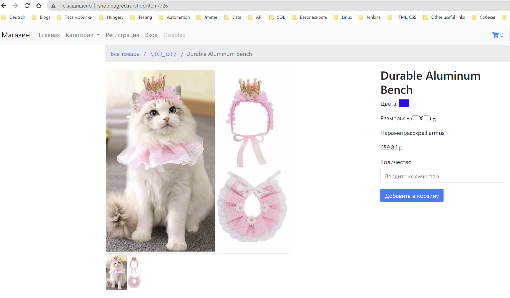

## Automated REST API tests for [Shop](http://shop.bugred.ru/)
https://testbase.atlassian.net/wiki/spaces/SHOP/overview?homepageId=1411056054
<p>
  
</p>
<p>
  
</p>

## Content

- [🛠️ Stack of technologies](#-stack-of-technologies)
- [📄 Description](#-description)
- [📋 List of REST API tests](#-list-of-rest-api-tests)
- [🔌 Running tests from the terminal](#-running-tests-from-the-terminal)
- [⚙️ Running tests in Jenkins](#-running-tests-in-jenkins)
- [📊 Test results report in Allure Report](#-test-results-report-in-allure-report)
- [🚀 Integration with Allure TestOps](#-integration-with-allure-testops)
- [🔗 Integration with Jira](#-integration-with-jira)
- [📣 Integration with Telegram](#-telegram-notifications-using-a-bot)

## 🛠️ Stack of technologies

<div style="text-align: center;">


</div>

## 📄 Description

The test project consists of REST API tests and includes the following interesting features:

- ✔️ **Parameterized tests**: Allows testing of various scenarios by providing different input data
- ✔️ **Object serialization/deserialization**: Handles API requests and responses using `Jackson` for seamless data transformation
- ✔️ **Request specification**: Uses request specifications to simplify and centralize API test configuration
- ✔️ **Fake data generation**: Utilizes the `Faker` library for generating random test data
- ✔️ **Custom Allure listener**: Provides beautiful logging of API requests and responses
- ✔️ **Allure TestOps integration**: Integrates with Allure TestOps for comprehensive test reporting and analytics
- ✔️ **Jira integration**: Seamlessly tracks issues and integrates with Jira for efficient collaboration
- ✔️ **Parallel execution**: Executes tests in parallel for faster feedback and reduced execution time

## 📋 List of REST API tests

### Create item

- [x] Create item in Shop with all fields
- [x] Create item in Shop with required fields
- [x] Unsuccessful item creation: missing required parameter
- [x] Create item with photo with width more than 500px

### Delete item

- [x] Delete item in Shop
- [x] Delete item with bad id

## 🔌 Running tests from the terminal

To run tests from the terminal using Gradle, you can use the following command:

```bash
gradle clean test
```

##  Running tests in [Jenkins](https://jenkins.autotests.cloud/job/Students/job/18-alin_laegnor-shop_api_tests/)
Main page of the build:

<div style="text-align: center;">
  
</div>

Job configuration:
<div style="text-align: center;">
  
</div>

##  Test results report in [Allure Report](https://jenkins.autotests.cloud/job/Students/job/18-alin_laegnor-shop_api_tests/6/allure/)

From <code><strong>Jenkins</strong></code> it is possible to switch to reports generated by <code><strong>
Allure</strong></code>.

<div style="text-align: center;">
  
</div>
<div style="text-align: center;">
  
</div>

##  Integration with [Allure TestOps](https://allure.autotests.cloud/launch/25185)

<div style="text-align: center;">
  
</div>
<div style="text-align: center;">
  
</div>

##  Integration with [Jira](https://jira.autotests.cloud/browse/HOMEWORK-743)

<div style="text-align: center;">
  
</div>

##  Telegram notifications using a bot

After passing all the tests, an automatic report is sent to the <code>Telegram</code> messenger.

<div style="text-align: center;">
    
</div>

[Back to content](#content)
